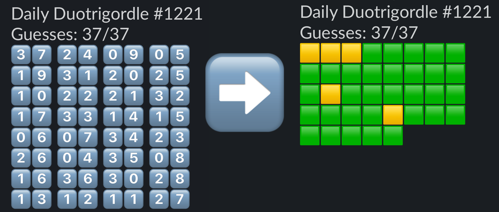

# Duotrigordle Visualizer

[Duotrigordle](https://duotrigordle.com/) is a wonderful little game, but I don't love its current visualization. This SPA let you quickly generate an alternative visualization.



The new visualization shows 1 square for each guess you make, right (🟩) or wrong (🟨).

## Local Development

If you've got most-any version of node installed, you can serve this app locally using the following:

```
$ npx serve@latest -l 3033
```
